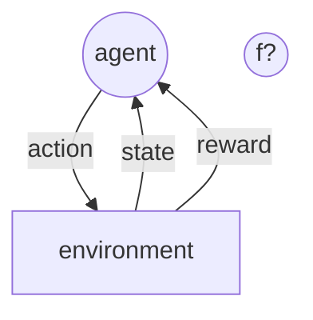
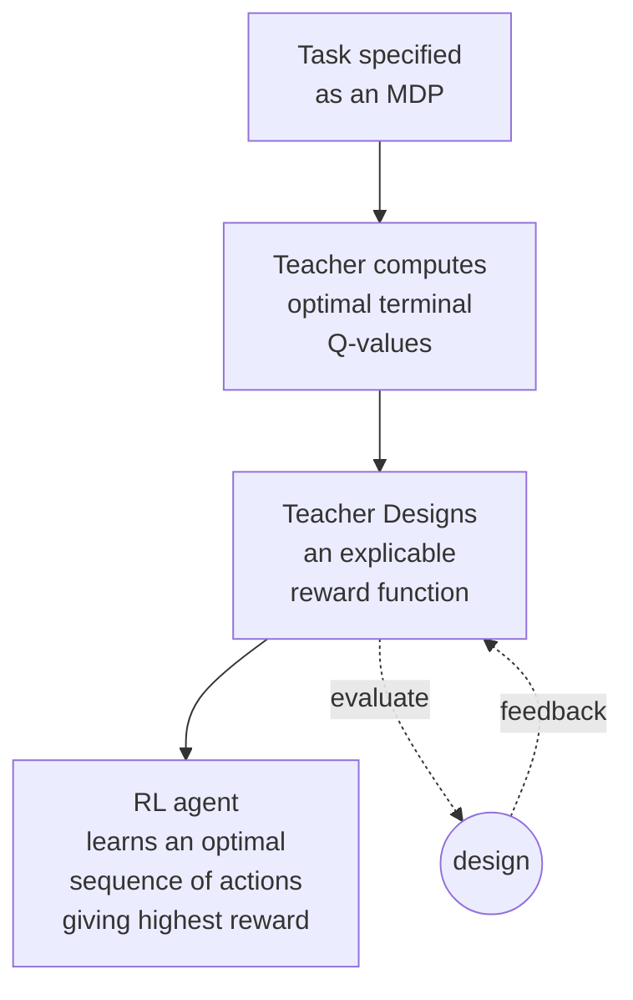

# Reward Design

## Concept Check
 
 &nbsp;
 
### Definitions

A reward function plays the central role during the 
learning/training phase of a reinforcement learning agent. 

Given a "task" to perform, there are, typically, many possible 
reward specifications for achieving a desired optimal result.

However, this freedom in choosing the reward function leads to
the fundamental question of reward design: _What criteria should one consider in designing a reward function for an agent, apart from the agent's **final output policy**?_

&nbsp;

#### Typical RL routine

#### Important criteria

##### 1. Informativeness

Many environments have [[delayed rewards]] that incrementally converge to the optimal actions. However, delayed rewards usually delay convergence!

How much useful information does a reward function convey at each step? &mdash; that can be important in nudging an agent down the action sequence that converges on the optimal state.

Moreover, a good measure of reward should have strong concavity
&mdash; the more varied the rewards for different actions, the better this aspect can be achieved.

##### 2. Sparseness

Sparseness is a proxy for the ease of interpretability of a reward.
A good reward metric should be easily understandable by the agent.

##### 3. How to balance the different factors

Most environments usually have more than one variable being optimized.
Indeed, sometimes a certain step might improve one variable and lower another. How much does each of the variables count?

Additionally, how are the other criteria balanced? 

A good measure of reward should not be too complicated as to not be understood by the agent, but it should also not be too simple that it does not capture important nuances in the environment &mdash; crippling its informativeness.

&nbsp;

#### The motivation for reward design

A good reward metric can help the agent to converge on an optimal policy faster.

### Related
[[Reward Design 02]]

Tags
#ReinforcementLearning 
#AI
